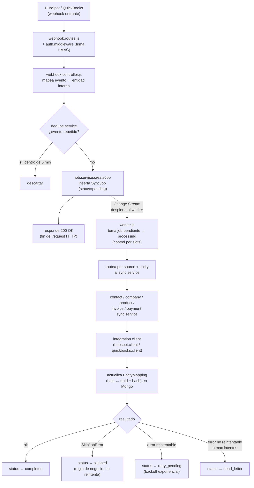
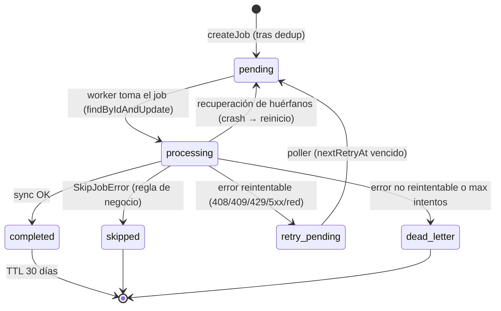

# Arquitectura — SmartFlow-Quickbooks

> Documento de onboarding para personas desarrolladoras. Explica **cómo está construido** el sistema y **por qué**. Para el detalle técnico exhaustivo (escrito como referencia para asistentes de IA) ver [`../CLAUDE.md`](../CLAUDE.md). Para las reglas de negocio por entidad y el troubleshooting de usuario final, ver la [Guía de Usuario](./Guia-de-Usuario-Integracion-HubSpot-QuickBooks.md). Para pendientes, riesgos y dependencias, ver [`Estado del Proyecto`](./ESTADO-DEL-PROYECTO.md).

---

## 1. Visión general

SmartFlow-Quickbooks es una **integración de sincronización bidireccional** entre **HubSpot** (CRM) y **QuickBooks Online** (contabilidad). Cuando un dato cambia en una plataforma, el sistema lo refleja en la otra: contactos, empresas, productos, facturas y pagos.

**Qué problema resuelve:** elimina la doble digitación y los descuadres entre el CRM y la contabilidad. Un contacto creado en HubSpot aparece como cliente en QuickBooks (y viceversa); una factura pagada en HubSpot se registra en QuickBooks; un pago en HubSpot se deposita en la cuenta bancaria correcta según su moneda.

**Qué NO es:**

- **No es una API REST.** No expone endpoints CRUD para consumo de terceros. Lo único que escucha son **webhooks** (de HubSpot y QuickBooks), los **endpoints de OAuth** (para conectar QuickBooks) y un par de **páginas estáticas** (`/privacy`, `/eula`) que Intuit exige para el listado de la app.
- **No procesa nada de forma síncrona en el request.** El webhook solo encola un trabajo (job) en MongoDB y responde `200` de inmediato. Todo el trabajo real ocurre después, en un **worker** en segundo plano.

**Stack:**

| Capa | Tecnología |
|---|---|
| Runtime | Node.js 24 (CommonJS, sin paso de build) |
| Framework HTTP | Fastify 5 |
| Base de datos | MongoDB (vía Mongoose 9) — **debe correr como replica set** |
| Cliente HTTP | axios 1.x |
| Logging | winston + winston-daily-rotate-file |
| Otros | zod (validación), uuid (correlation/job IDs), dotenv |

> No hay suite de tests ni linter configurado. `package.json` (name `api`, v1.1.0, MIT) define solo `npm start` y `npm run dev`. Esta es la principal deuda técnica del proyecto.

---

## 2. Flujo de una request

Todo evento entrante sigue el mismo camino: el webhook **no hace el trabajo**, solo crea un `SyncJob` en MongoDB; el **worker** lo recoge y lo procesa de forma asíncrona.



La clave: el request HTTP termina en `200 OK` apenas se encola el job (paso `R`). El procesamiento (pasos `F`–`O`) ocurre fuera del ciclo del request, en el worker.

---

## 3. Estructura de carpetas

```
src/
├── app.js                 # Setup de Fastify: middlewares, parsers, registro de rutas
├── server.js              # Entrypoint: connectDB() → app.listen() → startWorker()
├── config/                # Configuración centralizada y constantes
│   ├── index.js           #   Validación fail-fast de env vars + objeto config
│   └── constants.js       #   Enums: JOB_STATUS, SOURCES, ENTITIES, props mapeadas HS
├── controllers/           # Traducen requests entrantes a acciones del dominio
│   ├── auth.controller.js #   Flujo OAuth de QuickBooks
│   └── webhook.controller.js  # Webhooks HS/QB → creación de SyncJob
├── db/
│   ├── database.js        # Conexión Mongoose
│   └── models/            # Esquemas Mongoose (las 6 colecciones)
├── integrations/          # Clientes de cada plataforma externa
│   ├── hubspot/           #   hubspot.client.js (contacts, companies, products, invoices…)
│   └── quickbooks/        #   quickbooks.client.js (+ auto-refresh) y quickbooks.mapper.js
├── lib/                   # Utilidades transversales reutilizables
│   ├── crypto.lib.js      #   AES-256-GCM para cifrar tokens en reposo
│   ├── logger.lib.js      #   Logger winston con rotación diaria
│   └── response.lib.js    #   Helpers de respuesta JSON estandarizada
├── middlewares/           # Ganchos del pipeline HTTP de Fastify
│   ├── api-key.middleware.js     # Valida x-api-key (timing-safe) en endpoints de auth
│   ├── auth.middleware.js        # Valida firma HMAC de webhooks HS/QB
│   └── correlation.middleware.js # Propaga/genera x-correlation-id
├── routes/                # Declaración de rutas (webhook, auth, estáticas)
├── scripts/               # Scripts one-shot (seeding, migración, configuración)
├── services/              # LÓGICA DE NEGOCIO (sync por entidad + soporte)
│   ├── *.sync.service.js  #   Un servicio por entidad sincronizada
│   ├── job.service.js     #   CRUD de jobs + dedup + reintentos
│   ├── dedupe.service.js  #   Dedup de eventos (ventana 5 min)
│   ├── mapping.service.js #   Upsert/lookup de EntityMapping
│   └── auth.service.js    #   Tokens, OAuth exchange, refresh con guarda de concurrencia
├── tasks/
│   └── worker.js          # EL MOTOR: procesa jobs concurrentes + poller de reintentos
└── utils/                 # Helpers puros del dominio
    ├── backoff.util.js    #   Backoff exponencial + clasificación de errores reintentables
    ├── date.util.js       #   Fechas timezone-aware (UTC de HS → fecha local de QB)
    ├── echo.suppression.util.js  # Sets TTL en memoria para evitar loops de sync
    ├── errors.util.js     #   Jerarquía de errores (AppError, SkipJobError…)
    └── mutex.util.js      #   Ejecución secuencial por clave (per-entity lock)
```

**Responsabilidad de cada carpeta:**

- `config/` — única fuente de verdad de configuración; valida las env vars al arrancar (fail-fast).
- `controllers/` — capa delgada: traducen el formato externo (webhook/OAuth) a llamadas de servicio. No contienen lógica de negocio.
- `db/models/` — esquemas Mongoose; ver [§5 Modelo de datos](#5-modelo-de-datos).
- `integrations/` — todo lo que habla con HubSpot o QuickBooks por HTTP vive aquí. El resto del código no usa axios directamente contra esas APIs.
- `services/` — el **corazón**: un `*.sync.service.js` por entidad, más servicios de soporte (jobs, dedup, mapping, auth).
- `tasks/worker.js` — el motor de procesamiento en segundo plano.
- `utils/` — funciones puras y helpers sin estado de plataforma.

---

## 4. Componentes principales

| Componente | Archivo(s) | Responsabilidad |
|---|---|---|
| **Config** | `config/index.js`, `config/constants.js` | Valida env vars al arrancar (falla rápido si falta algo). Expone enums de estados de job, fuentes, entidades y propiedades HS mapeadas. |
| **Controller de webhooks** | `controllers/webhook.controller.js` | Mapea cada evento HS/QB a una entidad interna y encola un `SyncJob`. Aplica el "escudo" de facturas (solo dispara con `hs_balance_due=0`). Soporta formato legacy y CloudEvents de QB. |
| **Controller de auth** | `controllers/auth.controller.js` | Flujo OAuth de QuickBooks: connect, callback, status, disconnect. |
| **Sync services** | `services/*.sync.service.js` | Lógica de negocio por entidad (contact, company, product, invoice, payment). Validaciones de identidad, moneda, estado; resolución de mappings; llamadas a los clients. |
| **Job service** | `services/job.service.js` | Crea jobs (con dedup en el intake), marca estados, programa reintentos. |
| **Integration clients** | `integrations/hubspot/hubspot.client.js`, `integrations/quickbooks/quickbooks.client.js` | Encapsulan las APIs externas. El client de QB auto-refresca tokens ante un `401` (interceptor axios con guarda de concurrencia). `quickbooks.mapper.js` construye los payloads de factura/línea. |
| **Worker** | `tasks/worker.js` | Reclama y procesa jobs concurrentemente (concurrencia 3 por defecto), se despierta por Change Stream, corre el poller de reintentos cada 30 s y recupera jobs huérfanos al arrancar. |
| **DB models** | `db/models/*.model.js` | Esquemas de las 6 colecciones; ver [§5](#5-modelo-de-datos). |
| **lib** | `lib/crypto.lib.js`, `lib/logger.lib.js`, `lib/response.lib.js` | Cifrado de tokens (AES-256-GCM), logging con rotación, respuestas JSON. |
| **Middlewares** | `middlewares/*.middleware.js` | Validación de firma de webhooks, API key timing-safe, correlation ID. |
| **Utils** | `utils/*.util.js` | Backoff, fechas timezone-aware, echo suppression, errores, mutex por entidad. |

---

## 5. Modelo de datos

Seis colecciones en MongoDB (esquemas en `src/db/models/`):

| Colección (modelo) | Para qué sirve |
|---|---|
| `entitymappings` (`entity_mapping.model.js`) | **Fuente de verdad de la relación `hsId ↔ qbId`** por entidad. Guarda además el `syncToken` de QB y un **hash MD5** del último payload sincronizado (idempotencia). Índices únicos en `(tenantId, entityType, hsId)` y `(tenantId, entityType, qbId)`. |
| `event_dedup` (`event_dedup.model.js`) | Ventana de **deduplicación de eventos** (TTL 5 min). Cada webhook se hashea; las re-entregas idénticas se descartan antes de crear un job. |
| `syncjobs` (`job.model.js`) | **La cola de trabajos.** Cada documento es un job con su estado (ver [§6](#6-motor-de-jobs-y-ciclo-de-vida)), intentos, `nextRetryAt`, etc. Índices compuestos por `(tenantId, status, createdAt)` y `(status, nextRetryAt)`. TTL de 30 días sobre `completedAt`, acotado por `partialFilterExpression` a jobs **cerrados** (`completed`/`skipped`/`dead_letter`); los `pending`/`processing`/`retry_pending` nunca expiran. |
| `oauth_states` (`oauth_state.model.js`) | `state` anti-CSRF del flujo OAuth de QuickBooks (TTL 10 min, uso único). |
| `syncaudits` (`sync_audit.model.js`) | Esquema de **bitácora de auditoría** (entidad, acción, origen/destino, descripción, duración). ⚠️ **Definido pero sin usar:** ningún código escribe en esta colección hoy; la trazabilidad real está en los logs de Winston y en el `status`/`lastError` de `syncjobs`. |
| `tenants` (`tenant.model.js`) | **Configuración multi-tenant**: credenciales cifradas (HubSpot token, QB access/refresh tokens, realmId), `utcOffsetMilliseconds`, y preferencias (`depositAccounts`, `taxMappings` —este último vestigial—, defaults de QB descubiertos en el OAuth). |

---

## 6. Motor de jobs y ciclo de vida

El worker (`src/tasks/worker.js`) es un **motor pull-based**: no recibe el job empujado, sino que **busca** trabajo cuando hay capacidad.

**Cómo funciona:**

1. **Concurrencia.** Procesa hasta `WORKER_CONCURRENCY` jobs en paralelo (3 por defecto). Lleva un contador `activeJobs`; cuando se libera un slot, `processNextJobs()` se vuelve a llamar recursivamente para recoger más trabajo.
2. **Toma de jobs.** Encuentra jobs `pending` ordenados por antigüedad (`find({ status: pending })`) y marca cada uno como `processing` con `findByIdAndUpdate(_id)`. Dentro de un mismo proceso, el contador `activeJobs` y el modelo de slots evitan la sobre-suscripción. **Ojo:** esa actualización es por `_id` y **no** lleva la guarda `status: pending` en el filtro, así que **no** es un reclamo condicional atómico — correr **varias instancias** del worker en paralelo podría hacer que dos tomen el mismo job. La recuperación de huérfanos y el mutex por entidad mitigan el riesgo, pero para escalar horizontalmente habría que volver el claim condicional (ver mejoras en el [Estado del Proyecto](./ESTADO-DEL-PROYECTO.md)).
3. **Wake-up por Change Stream.** Un `SyncJob.watch()` sobre inserts despierta al motor apenas se encola un job nuevo (de ahí el requisito de replica set en Mongo). No hay polling activo para el caso feliz.
4. **Poller de reintentos.** Cada 30 s busca jobs `retry_pending` cuyo `nextRetryAt` ya pasó y los devuelve a `pending` para que el motor los recoja.
5. **Recuperación de huérfanos.** Al arrancar, todo job que quedó en `processing` (por un crash anterior) se devuelve a `pending`.
6. **Backoff.** Los reintentos usan backoff exponencial: `2^intentos * 1000ms + jitter`. Máximo 3 intentos por defecto (`MAX_RETRY_ATTEMPTS`).

**Clasificación de errores** (en `utils/backoff.util.js`):

- **Reintentables** → `retry_pending`: `408`, `409`, `429`, `5xx`, errores de red.
- **No reintentables** → `dead_letter`: `400`, `401`, `403`, `404`, `422`.
- **Reglas de negocio** → `skipped`: cualquier `SkipJobError` (ver [§7](#7-conceptos-clave-de-sincronización)). No consume reintentos.

**Estados del job:**



> El estado `suppressed` también existe en `constants.js` y se usa cuando un job se descarta por echo suppression (ver [§7](#7-conceptos-clave-de-sincronización)).

---

## 7. Conceptos clave de sincronización

Resúmenes de un párrafo. El detalle profundo (campos exactos, reglas por entidad, casos borde) está en [`../CLAUDE.md`](../CLAUDE.md) y la [Guía de Usuario](./Guia-de-Usuario-Integracion-HubSpot-QuickBooks.md).

- **EntityMapping + idempotencia por hash.** Cada relación `hsId ↔ qbId` se guarda en `entitymappings` junto a un hash MD5 del último payload. Si el hash coincide en el siguiente evento, **no se llama la API externa**: el sync es un no-op. (Nota: el hash tiene formato distinto por dirección HS→QB vs QB→HS; el primer evento cross-dirección siempre dispara un update inocuo. Detalle en `CLAUDE.md`.)

- **Dedup de eventos.** Cada webhook entrante se hashea (sha256, primeros 16 chars) y se guarda en `event_dedup` con TTL de 5 min. Re-entregas idénticas de HS/QB se descartan antes de crear el job (`dedupe.service.js`).

- **Echo suppression.** Cuando el sync **escribe** en HS o QB, marca ese ID en memoria para que el webhook resultante no genere un loop. TTLs asimétricos: 10 s para HS (casi instantáneo), 30 s para QB (procesa en lotes). Ver `utils/echo.suppression.util.js`.

- **Mutex por entidad.** El worker envuelve cada job en un lock secuencial por `entityId` (`runSequentially`) para que dos workers no escriban el mismo registro a la vez. La creación de facturas además se serializa por tenant para no duplicar el `DocNumber`. Ver `utils/mutex.util.js`.

- **SkipJobError.** Clase de error que señala un **aborto por regla de negocio**, no un fallo. El worker lo marca como `skipped` (sin reintentar). Subclases: `InactiveCustomerError`, `InactiveParentError`, `MissingIdentityError`, `MissingNitError`, `CurrencyMismatchError`. Úsalas al añadir una regla que deba cortar el sync sin gastar reintentos. Ver `utils/errors.util.js`.

- **Fechas timezone-aware.** HubSpot envía timestamps UTC que representan "fin del día" en la zona del cliente. `formatToQbDate` aplica el `utcOffsetMilliseconds` del tenant antes de formatear a `YYYY-MM-DD`, evitando errores de fecha por un día. Ver `utils/date.util.js`.

- **Multi-tenancy.** El sistema está diseñado para múltiples tenants (credenciales y preferencias por tenant en `tenants`), pero hoy corre con un solo `DEFAULT_TENANT_ID`. El webhook controller fija el tenant de forma estática; resolver el tenant por payload queda pendiente para multi-cliente real.

- **Cifrado de tokens + auto-refresh.** Los tokens de QuickBooks se cifran en reposo con AES-256-GCM (`ENCRYPTION_KEY`, 64 hex). El client de QB auto-refresca el access token ante un `401` con una guarda de concurrencia (varios `401` comparten una sola promesa de refresh por tenant). El token de HubSpot es de app privada (estático, sin refresh automático).

---

## 8. Servicios externos y su integración

| Servicio | Rol | Cómo se integra |
|---|---|---|
| **HubSpot (CRM)** | Una de las dos plataformas sincronizadas. Origen/destino de contactos, empresas, productos, facturas (`objectTypeId 0-53`) y pagos (`0-101`). | API con **token de app privada** (`HUBSPOT_ACCESS_TOKEN`, estático, sin OAuth/refresh). Webhooks entrantes en `POST /webhook/hubspot`, firmados con `HUBSPOT_APP_SECRET` (HMAC v3 preferido, v1 fallback). La app HS debe suscribir: `contact.*`, `company.*`, `object.propertyChange` para `0-7` (productos) y `0-53` (facturas, solo dispara con `hs_balance_due=0`), `object.creation` para `0-101` (pagos). |
| **QuickBooks Online / Intuit** | La otra plataforma sincronizada: API de Accounting (customers, items, invoices, payments). | **OAuth 2.0** (`QB_CLIENT_ID`, `QB_CLIENT_SECRET`, `QB_REDIRECT_URI`). Access token ~1 h, refresh token ~100 días; ambos cifrados en reposo y auto-refrescados ante `401`. Webhooks en `POST /webhook/quickbooks` firmados con `QB_WEBHOOK_VERIFIER_TOKEN`. Soporta formato legacy y **CloudEvents** (obligatorio tras julio 2026 — el código ya lo parsea; falta activar el switch en el portal de Intuit). `QB_SANDBOX_BASE_URL` controla sandbox vs producción (el nombre dice "sandbox" por legado, pero aplica a ambos). |
| **MongoDB (replica set rs0)** | Base de datos: cola de jobs, EntityMappings, dedup, OAuth states y config multi-tenant. | Conexión vía `MONGODB_URI`. **Debe ser replica set** (`rs0`), no standalone: el worker usa Change Streams (`SyncJob.watch`), que requieren replica set. El `docker-compose.yml` incluye un servicio `mongo-init` que ejecuta `rs.initiate` una sola vez. |

> Conexión inicial de QuickBooks: visitar `GET /auth/quickbooks/connect` (con header `x-api-key`), autorizar en Intuit, y los tokens cifrados quedan en el tenant. Verificar con `GET /auth/quickbooks/status`. Pasos completos en el README (sección "Puesta en producción") y en [`../CLAUDE.md`](../CLAUDE.md).

---

## 9. Seguridad

- **Firma de webhooks (HMAC).** `auth.middleware.js` valida la firma de cada webhook entrante: HubSpot (`x-hubspot-signature-v3`, fallback v1, con ventana anti-replay de 5 min) y QuickBooks (firma de Intuit). **En `development`/`test` la validación hace bypass** — riesgo si `NODE_ENV` queda en `development` en un servidor expuesto: cualquiera podría enviar webhooks falsos. El runbook obliga a verificar `NODE_ENV=production`.
- **API key timing-safe.** Los endpoints `GET /auth/quickbooks/{connect,status,disconnect}` exigen `x-api-key` (`INTERNAL_API_KEY`), validado con `crypto.timingSafeEqual` para evitar ataques de timing (`api-key.middleware.js`).
- **Cifrado de tokens en reposo.** Los tokens de QuickBooks se cifran con **AES-256-GCM** (`ENCRYPTION_KEY`, exactamente 64 caracteres hex; el arranque falla si no). Si se pierde la llave, los tokens quedan irrecuperables (hay que rehacer el OAuth). Resguardar la llave fuera del servidor.
- **Hardening HTTP** (`app.js`): **Helmet** (cabeceras de seguridad, CSP deshabilitado), **CORS**, **compresión** gzip/deflate y **rate limit** de 100 req/min por IP. Además, un parser de JSON custom preserva el `rawBody` para poder validar las firmas HMAC. ⚠️ **CORS hoy está abierto:** `app.js` registra `cors({ origin: true })`, que **refleja cualquier origen**. La env var `ALLOWED_ORIGINS` se parsea en `config/index.js` pero **aún no está cableada**; conectarla es una mejora de seguridad pendiente (ver [Estado del Proyecto](./ESTADO-DEL-PROYECTO.md)).
- **OAuth anti-CSRF.** El flujo de QuickBooks usa un `state` aleatorio guardado en `oauth_states` (TTL 10 min, uso único) que se valida en el callback.

---

## 10. Decisiones de diseño clave

- **Cola de jobs en MongoDB (no Redis/SQS).** Reaprovecha la misma base de datos que ya guarda los mappings y la config — menos infraestructura que operar. Los jobs **persisten entre reinicios**: si el proceso cae, los jobs encolados siguen ahí y los huérfanos en `processing` se recuperan a `pending` al arrancar.

- **MongoDB como replica set (obligatorio).** El worker se despierta con **Change Streams**, que solo existen en replica sets. Esto evita un polling constante a la base de datos para el caso feliz. La contrapartida: un `mongod` standalone hace fallar el worker aunque la app arranque — es un punto frágil del despliegue que el runbook advierte explícitamente.

- **Procesamiento asíncrono, request mínimo.** El webhook solo encola y responde `200`. Esto desacopla la latencia/disponibilidad de HS y QB del tiempo de respuesta al webhook (HubSpot y Intuit reintentan si no reciben `200` rápido), y permite reintentos controlados con backoff sin presionar al emisor.

- **Worker pull-based.** En vez de empujar el job a un slot, el motor **busca** trabajo cuando tiene capacidad (contador `activeJobs`) y lo marca `processing`. Da un control de concurrencia simple **dentro de un proceso**. Hoy el reclamo **no** es condicional por estado (ver [§6](#6-motor-de-jobs-y-ciclo-de-vida)), por lo que el diseño asume **una sola instancia** del worker; escalar a varias requeriría un claim atómico real (`findOneAndUpdate({ _id, status: pending })`).

- **Idempotencia por hash + echo suppression.** Como el sync escribe de vuelta en la otra plataforma, todo cambio dispara un webhook de retorno. El hash de payload corta los no-ops y la echo suppression corta los loops. Juntos, evitan tormentas de sincronización.

- **`SkipJobError` vs error normal.** Separa explícitamente "esto no debe sincronizarse por regla de negocio" (→ `skipped`, sin reintentos) de "esto falló y vale la pena reintentar" (→ `retry_pending`). Sin esta distinción, un contacto sin documento de identidad consumiría reintentos inútilmente.

- **Multi-tenant desde el diseño, single-tenant en operación.** El modelo de datos y los servicios reciben `tenantId` en todas partes, aunque hoy se use un solo tenant. Esto deja la puerta abierta a multi-cliente sin reescribir el núcleo (falta solo la resolución de tenant por webhook).

---

## Referencias

- [`../CLAUDE.md`](../CLAUDE.md) — referencia técnica profunda (fuente de verdad técnica).
- [Guía de Usuario](./Guia-de-Usuario-Integracion-HubSpot-QuickBooks.md) — reglas de negocio por entidad y troubleshooting.
- [Estado del Proyecto](./ESTADO-DEL-PROYECTO.md) — pendientes, riesgos, mejoras, incidencias y dependencias.
- [`../README.md`](../README.md) — punto de entrada del repositorio.
- [`../.env.example`](../.env.example) — inventario de variables de entorno.
